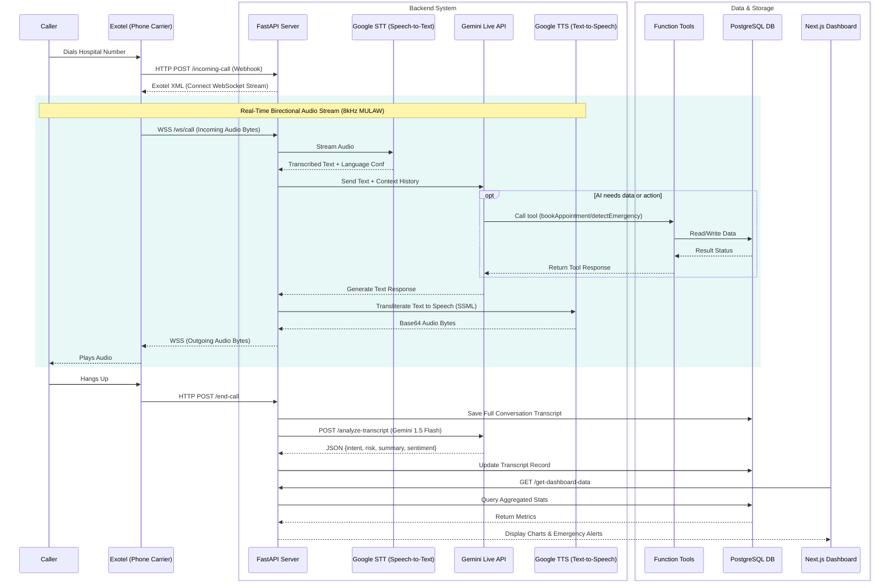

# Gemini Hospital AI Call Agent — Architecture

## Component Flow Diagram

## System Components

1. **Voice Gateway (Exotel)**: Handles the physical SIP/telephony connection and streams audio over WebSockets to the backend.
2. **Speech Engine (Google Cloud)**: 
   - **STT v2**: Optimized for telephony, supports en-US, hi-IN, ta-IN simultaneously.
   - **TTS**: Neural2 voices using SSML for warm, natural prosody.
3. **Core Intelligence (Gemini 2.0 Flash)**: Acts as the reasoning engine and conversational agent, leveraging function calling to interact with hospital systems.
4. **Analysis Engine (Gemini 1.5 Flash)**: Processes completed transcripts to extract structured JSON insights for the admin dashboard.
5. **Database (PostgreSQL)**: Stores patient profiles, call logs, transcripts, and doctor schedules securely using SQLAlchemy ORM.
6. **Admin Dashboard (Next.js)**: A real-time monitoring interface for hospital staff to manage appointments, track AI escalation metrics, and view emergency flags.
